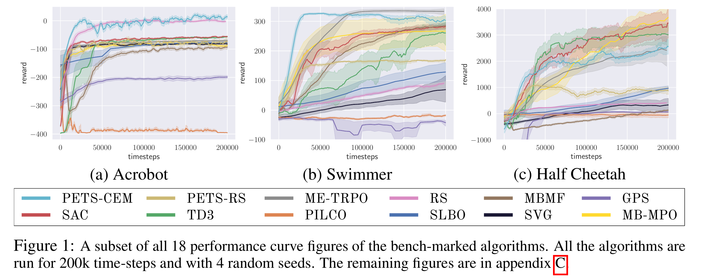
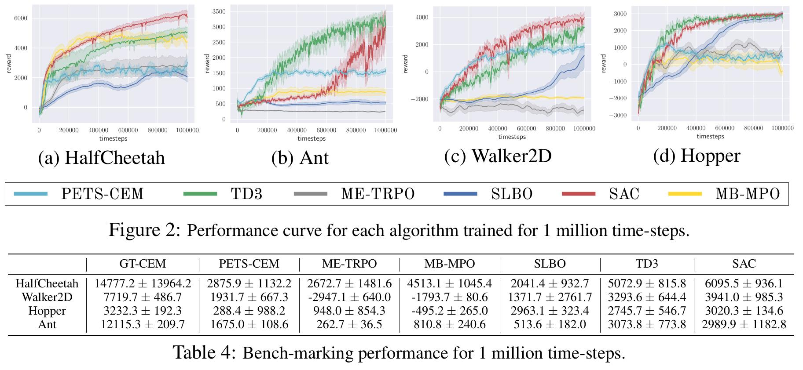

# Model Based Reinforcement Learning Benchmarking Library (MBBL)

<p align=center>

</p>
<p align=center>

</p>

# Introduction

[Arxiv Link](https://arxiv.org/abs/1907.02057) [PDF](https://arxiv.org/pdf/1907.02057.pdf) [Project Page](http://www.cs.toronto.edu/~tingwuwang/mbrl.html) Abstract: Model-based reinforcement learning (MBRL) is widely seen as having the potential to be significantly more sample efficient than model-free RL. However, research in model-based RL has not been very standardized. It is fairly common for authors to experiment with self-designed environments, and there are several separate lines of research, which are sometimes closed-sourced or not reproducible. Accordingly, it is an open question how these various existing MBRL algorithms perform relative to each other. To facilitate research in MBRL, in this paper we gather a wide collection of MBRL algorithms and propose over 18 benchmarking environments specially designed for MBRL. We benchmark these MBRL algorithms with unified problem settings, including noisy environments. Beyond cataloguing performance, we explore and unify the underlying algorithmic differences across MBRL algorithms. We characterize three key research challenges for future MBRL research: the dynamics coupling effect, the planning horizon dilemma, and the early-termination dilemma.

# Installation

Install the project with pip from the top-level directory:
```
pip install --user -e .
```
For sub-packages of algorithms not integrated here, please refer to the respective readmes.

# Algorithms

Some of the algorithms are not yet merged into this repo. We use the following colors to represent their status.
 indicates `Merged into this repo`.
 indicates `In a separate repo.`

## Shooting Algorithms

### 1. Random Shooting (RS) 
Rao, Anil V. "A survey of numerical methods for optimal control." Advances in the Astronautical Sciences 135.1 (2009): 497-528. [Link](http://www.anilvrao.com/Publications/ConferencePublications/trajectorySurveyAAS.pdf)
```
python main/rs_main.py --exp_id rs_gym_cheetah_seed_1234 \
    --task gym_cheetah \
    --num_planning_traj 1000 --planning_depth 10 --random_timesteps 10000 \
    --timesteps_per_batch 3000 --num_workers 20 --max_timesteps 200000 --seed 1234
```
The following script will test the performance when using ground-truth dynamics:
```
python main/rs_main.py --exp_id rs_${env_type}\
    --task gym_cheetah \
    --num_planning_traj 1000 --planning_depth 10 --random_timesteps 0 \
    --timesteps_per_batch 1 --num_workers 20 --max_timesteps 20000 \
    --gt_dynamics 1
```
Also, set `--check_done 1` for agents to detect if the episode is terminated (needed for gym_fant, gym_fhopper).

### 2. Mode-Free Model-Based (MB-MF) 
Nagabandi, Anusha, et al. "Neural network dynamics for model-based deep reinforcement learning with model-free fine-tuning." arXiv preprint arXiv:1708.02596 (2017). [Link](https://arxiv.org/abs/1708.02596)
```
python main/mbmf_main.py --exp_id mbmf_gym_cheetah_ppo_seed_1234 \
    --task gym_cheetah --trust_region_method ppo \
    --num_planning_traj 5000 --planning_depth 20 --random_timesteps 1000 \
    --timesteps_per_batch 1000 --dynamics_epochs 30 \
    --num_workers 20 --mb_timesteps 7000 --dagger_epoch 300 \
    --dagger_timesteps_per_iter 1750 --max_timesteps 200000 \
    --seed 1234 --dynamics_batch_size 500
```

### 3. Probabilistic Ensembles with Trajectory Sampling (PETS-RS and PETS-CEM)  
Chua, K., Calandra, R., McAllister, R., & Levine, S. (2018). Deep reinforcement learning in a handful of trials using probabilistic dynamics models. In Advances in Neural Information Processing Systems (pp. 4754-4765). [Link](https://arxiv.org/abs/1805.12114)

See the codebase for [POPLIN](https://github.com/WilsonWangTHU/POPLIN), where you can benchmark PETS-RS and PETS-CEM following the readme.
PETS-RS with ground-truth is essentially RS with ground-truth, and to run the PETS-CEM with ground-truth dynamics:
```
python main/pets_main.py --exp_id pets-gt-gym_cheetah \
    --task gym_cheetah \
    --num_planning_traj 500 --planning_depth 30 --random_timesteps 0 \
    --timesteps_per_batch 1 --num_workers 10 --max_timesteps 20000 \
    --gt_dynamics 1
```

## Policy Search with Backpropagation through Time

### 4. Probabilistic Inference for Learning Control (PILCO) 
Deisenroth, M., & Rasmussen, C. E. (2011). PILCO: A model-based and data-efficient approach to policy search. In Proceedings of the 28th International Conference on machine learning (ICML-11) (pp. 465-472). [Link](https://www.ias.informatik.tu-darmstadt.de/uploads/Publications/Deisenroth_ICML_2011.pdf)

We implemented and benchmarked the environments in this repo [PILCO](https://github.com/edlanglois/mbbl-pilco).

### 5. Iterative Linear Quadratic-Gaussian (iLQG) 
Tassa, Y., Erez, T., & Todorov, E. (2012, October). Synthesis and stabilization of complex behaviors through online trajectory optimization. In 2012 IEEE/RSJ International Conference on Intelligent Robots and Systems (pp. 4906-4913). IEEE. [Link](https://homes.cs.washington.edu/~todorov/papers/TassaIROS12.pdf)
```
python main/ilqr_main.py  --exp_id ilqr-gym_cheetah \ 
    --max_timesteps 2000 --task gym_cheetah \
    --timesteps_per_batch 1 --ilqr_iteration 10 --ilqr_depth 30 \
    --max_ilqr_linesearch_backtrack 10  --num_workers 2 \
    --gt_dynamics 1
```

### 6. Guided Policy Search (GPS) 
Levine, Sergey, and Vladlen Koltun. "Guided policy search." International Conference on Machine Learning. 2013 [Link](http://rll.berkeley.edu/gps/)

We implemented and benchmarked the environments in this repo [GPS](https://github.com/WilsonWangTHU/mbbl-GPS).

### 7. Stochastic Value Gradients (SVG) 
Heess, N., Wayne, G., Silver, D., Lillicrap, T., Erez, T., & Tassa, Y. (2015). Learning continuous control policies by stochastic value gradients. In Advances in Neural Information Processing Systems (pp. 2944-2952). [Link](https://arxiv.org/abs/1510.09142)

We implemented and benchmarked the environments in this repo [SVG](https://github.com/WilsonWangTHU/mbbl-mbmpo) (will be set public soon).

## Dyna-Style Algorithms

### 8. Model-Ensemble Trust-Region Policy Optimization (ME-TRPO) 
Kurutach, Thanard, et al. "Model-Ensemble Trust-Region Policy Optimization." arXiv preprint arXiv:1802.10592 (2018). [Link](https://arxiv.org/abs/1802.10592)

We implemented and benchmarked the environments in this repo [ME-TRPO](https://github.com/WilsonWangTHU/mbbl-metrpo).

### 9. Stochastic Lower Bound Optimization (SLBO) 
Luo, Y., Xu, H., Li, Y., Tian, Y., Darrell, T., & Ma, T. (2018). Algorithmic Framework for Model-based Deep Reinforcement Learning with Theoretical Guarantees. [Link](https://arxiv.org/abs/1807.03858)

We implemented and benchmarked the environments in this repo [SLBO](https://github.com/WilsonWangTHU/mbbl-slbo)

### 10. Model-Based Meta-Policy-Optimzation (MB-MPO) 
Clavera, I., Rothfuss, J., Schulman, J., Fujita, Y., Asfour, T., & Abbeel, P. (2018). Model-based reinforcement learning via meta-policy optimization. arXiv preprint arXiv:1809.05214. [Link](https://arxiv.org/abs/1809.05214)
We implemented and benchmarked the environments in this repo [MB-MPO](https://github.com/WilsonWangTHU/mbbl-mbmpo) (will be set public soon).

##  Model-free Baselines

### 11. Trust-Region Policy Optimization (TRPO) 
Schulman, John, et al. "Trust region policy optimization." International Conference on Machine Learning. 2015. [Link](https://arxiv.org/abs/1502.05477)
```
python main/mf_main.py --exp_id trpo_gym_cheetah_seed1234 \
    --timesteps_per_batch 2000 --task gym_cheetah \
    --num_workers 5 --trust_region_method trpo --max_timesteps 200000
```

### 12. Proximal-Policy Optimization (PPO) 
Schulman, John, et al. "Proximal policy optimization algorithms." arXiv preprint arXiv:1707.06347 (2017). [Link](https://arxiv.org/abs/1707.06347)
```
python main/mf_main.py --exp_id ppo_gym_cheetah_seed1234 \
    --timesteps_per_batch 2000 --task gym_cheetah \
    --num_workers 5 --trust_region_method ppo --max_timesteps 200000
```
### 13. Twin Delayed Deep Deterministic Policy Gradient (TD3) 
Fujimoto, S., van Hoof, H., & Meger, D. (2018). Addressing function approximation error in actor-critic methods. arXiv preprint arXiv:1802.09477. [Link](https://arxiv.org/pdf/1802.09477)

We implemented and benchmarked the environments in this repo [TD3](https://github.com/WilsonWangTHU/mbbl-rlkit).

### 14. Soft Actor-Critic (SAC) 

Haarnoja, T., Zhou, A., Abbeel, P., & Levine, S. (2018). Soft actor-critic: Off-policy maximum entropy deep reinforcement learning with a stochastic actor. arXiv preprint arXiv:1801.01290. [Link](https://arxiv.org/abs/1801.01290)

We implemented and benchmarked the environments in this repo [SAC](https://github.com/WilsonWangTHU/mbbl-rlkit).

# Disclaimer

As mentioned in the project webpage, it is a developing (unfinished) project.
We are working towards a unified package for MBRL algorithms.
but it might take a while given that we lack the manpower.

# Engineering Stats and 1 Million Performance

<p align=center>

</p>
<p align=center>

</p>

## Env

Here is available environments and their mappings to the name used in the paper.

| Mapping Table |                |                       |               |                         |                   |               |
|---------------|----------------|-----------------------|---------------|-------------------------|-------------------|---------------|
| Env           | Pendulum       | InvertedPendulum      | Acrobot       | CartPole                | Mountain Car      | Reacher       |
| Repo-Name     | gym\_pendulum  | gym\_invertedPendulum | gym\_acrobot  | gym\_cartPole           | gym\_mountain     | gym\_reacher  |
| Env           | HalfCheetah    | Swimmer-v0            | Swimmer       | Ant                     | Ant-ET            | Walker2D      |
| Repo-Name     | gym\_cheetah   | gym\_swimmer          | gym\_fswimmer | gym\_ant                | gym\_fant         | gym\_walker2d |
| Env           | Walker2D-ET    | Hopper                | Hopper-ET     | SlimHumanoid            | SlimHumanoid-ET   | Humanoid-ET   |
| Repo-Name     | gym\_fwalker2d | gym\_hopper           | gym\_fhopper  | gym\_nostopslimhumanoid | gym\_slimhumanoid | gym\_humanoid |
